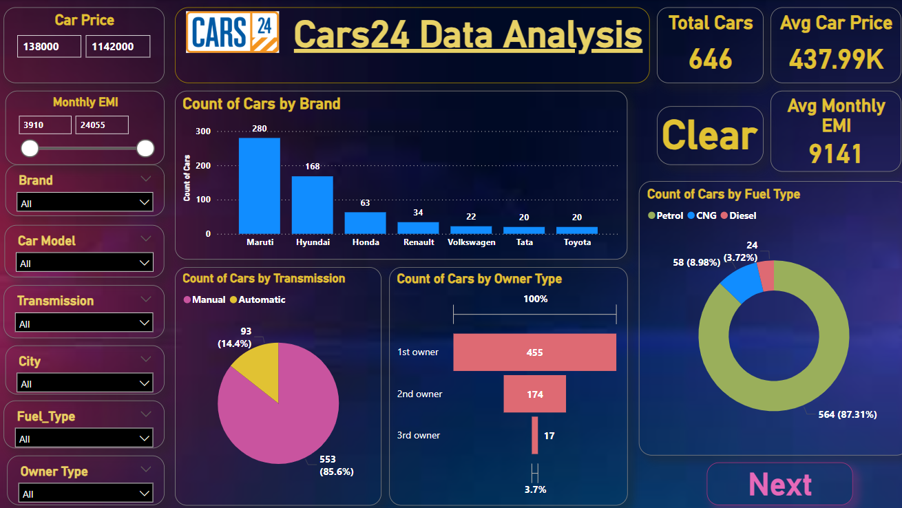

# **Title**: Cars24 Data Analytics

### **Overview**
This project involves a comprehensive analysis of data sourced from the Cars24 website, focusing on approximately 650 cars across three distinct locations. Our goal is to extract meaningful insights that will aid our client in understanding market trends, pricing dynamics, and consumer preferences within the Cars24 marketplace. Through detailed analysis of various parameters such as brand, model, year, price, kilometers driven, and location, we aim to provide actionable recommendations based on robust data-driven insights.

### **Objectives** :

1) **Evaluate Price Trends** :
Compare average car prices from different brands between the current year and the previous year to identify any notable changes or trends.

2) **Assess Usage Patterns** :
Determine the average kilometers driven by the cars in our dataset to understand typical usage patterns and consumer preferences.

3) **Identify Extremes** :
Identify the most expensive and least expensive cars listed on Cars24 to provide insights into the price range and market positioning.

4) **Analyze Market Share** :
Analyze the distribution of listings by car brands to identify which brands dominate the market on the Cars24 platform.

### **Tools used** :

1) Requests library
2) Selenium and bs4(BeautifulSoup) library
3) Pandas library
4) NumPy library
5) PowerBI Tool

### **Methodology** 🛠️

1) **Data Acquisition**: Initially, we request access to Cars24 servers for data scraping using the requests.get() method from the requests package. Following installation via pip install requests, we proceed by sending a request using request.get(url_of_cars24). Upon receiving a response code of 200, scraping activities commence.

2) **Web Scraping**: With permission granted, web scraping operations are executed using BeautifulSoup and Selenium. Leveraging various HTML tags, we extract textual content and organize it into a dictionary. Subsequently, the dictionary is transformed into a DataFrame using the pandas library.

3) **Data Cleaning**: Our data retrieval ensures completeness without any missing or NaN values. During data cleaning, columns are parsed and manipulated using pandas methods such as replace, remove, split, and slicing.

4) **Data Visualization**: Visualization tasks are carried out using PowerBI.

### **Quick Summary**
1.Using Selenium And BeautifulSoup libraries of Python we Extracted data present on page and stored it in series and merging them to get DataFrame.

**Web Scrapping Code**

# **Data After Scrapping**

## Table 1 :

# **Data During Cleaning**  

## Table 1:

# **Cleaned Data**

## Table 1 :

### **Challenges Faced During The Project** 

(1) Learning web scraping with different tools was challenging due to the diversity of tools, evolving website structures, anti-scraping measures, and the need for data cleaning and preprocessing.

(2) Dynamic page scrolling posed an additional challenge during the data scraping process, requiring specific techniques and tools to effectively capture and extract the desired information from web pages that load content dynamically as the user scrolls.

(3) Data quality and consistency were compromised in the scraped data from cars24, with errors, missing values, and inconsistencies present, thereby impacting the integrity of the raw dataset.

## **Final Dashboard On PowerBI**

### **Conclusion**

The used car market presents a dynamic landscape characterized by predominant petrol-powered vehicles with manual transmissions. Prices of second-hand cars show a consistent upward trend annually, reflecting evolving market dynamics. On platforms like Cars24, the average transaction price for a car stands at approximately 4.38 lakh. Maruti emerges as the leading brand in resale popularity, driven by its widespread appeal and reliability, while Kia stands out for commanding higher resale values, underscoring its premium positioning in the market. Second-hand cars typically have an average mileage of around 29,000 kilometers, highlighting their usage and condition. These insights provide a comprehensive overview of the current trends and factors influencing the resale market for cars.

